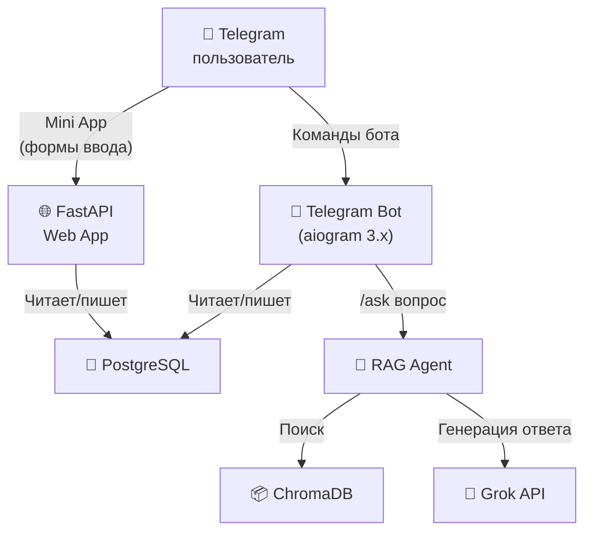
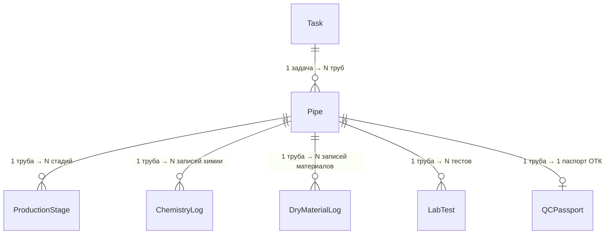
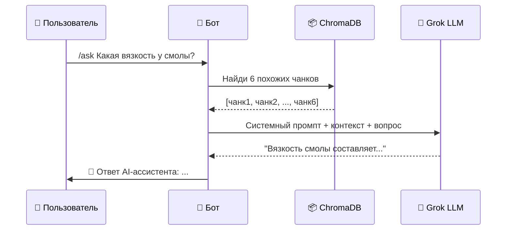

# 🏭 Полный разбор проекта MES Bot

> Это подробный гайд по **каждому файлу и каждой концепции** в проекте. Читай по порядку — каждый раздел построен от простого к сложному.

---

## 📐 Архитектура проекта (общая картина)



**Проект состоит из 4 главных частей:**

| # | Часть | Что делает | Папка |
|---|---|---|---|
| 1 | **База данных** | Хранит ВСЮ информацию: пользователей, задачи, трубы, материалы, тесты | `db/` |
| 2 | **Telegram Bot** | Интерфейс управления: команды, кнопки, FSM-диалоги | `bot/` |
| 3 | **Web App (FastAPI)** | Mini App внутри Telegram: формы ввода данных (химия, лаборатория, ОТК) | `web/` |
| 4 | **RAG Agent** | AI-ассистент: ищет в документации и отвечает на вопросы | `ai_agent/` |

---

## 📁 Структура файлов

```
mes_bot/
├── main.py                    # Точка входа всего приложения
├── core/
│   ├── config.py              # Настройки (из .env файла)
│   └── utils.py               # Утилиты (форматирование времени)
├── db/
│   ├── database.py            # Подключение к PostgreSQL
│   └── models.py              # ⭐ ВСЕ таблицы базы данных (609 строк)
├── bot/
│   ├── main.py                # Запуск бота + регистрация всех хэндлеров
│   └── handlers/
│       ├── base.py            # /start + авторизация + меню по ролям
│       ├── admin.py           # /new_task — создание задачи (FSM)
│       ├── shift_leader.py    # /work — управление стадиями СТАРТ/СТОП
│       ├── dosing.py          # /chemistry — открывает Mini App химии
│       ├── technologist.py    # /dry_materials — открывает Mini App технолога
│       ├── lab.py             # /lab — открывает Mini App лаборатории
│       ├── qc.py              # /qc_passport + /naming — ОТК
│       ├── report.py          # /pipe_report — досье на трубу
│       ├── ai_assistant.py    # /ask — вопросы к RAG-агенту
│       ├── inventory.py       # /stock — остатки склада
│       └── users_admin.py     # Управление пользователями
├── web/
│   ├── main.py                # FastAPI приложение
│   ├── schemas.py             # Pydantic-схемы валидации
│   ├── routes/                # 8 API-маршрутов
│   └── templates/             # 9 HTML-шаблонов (Mini App)
├── ai_agent/
│   ├── ingest.py              # Загрузка документов → ChromaDB
│   └── rag_chain.py           # Поиск + генерация ответа через LLM
├── docker-compose.yml         # PostgreSQL в Docker
├── alembic/                   # Миграции базы данных
└── data/docs/                 # PDF/DOCX документация для RAG
```

---

## 1️⃣ Конфигурация — [config.py](file:///Users/komilrasulov/Antigravity/mes_bot/core/config.py)

**Что это:** Файл настроек, который читает переменные из `.env` файла.

**Как работает:**
```python
class Settings(BaseSettings):     # Pydantic автоматически читает .env
    DB_HOST: str = "localhost"     # Если в .env нет — берётся значение по умолчанию
    BOT_TOKEN: str = ""            # Токен Telegram бота
    GROK_API_KEY: str = ""         # Ключ для LLM API
```

**Ключевая идея:** `pydantic_settings` — библиотека, которая автоматически:
- Читает файл `.env`
- Парсит переменные окружения
- Валидирует типы (int, str, bool)
- Даёт значения по умолчанию

`settings = Settings()` внизу файла — это **синглтон** (один объект на всё приложение). Его импортируют отовсюду: `from core.config import settings`.

---

## 2️⃣ База данных

### 2.1 Подключение — [database.py](file:///Users/komilrasulov/Antigravity/mes_bot/db/database.py)

```python
engine = create_async_engine(settings.DATABASE_URL, pool_size=10)
```

**Что тут происходит:**
- `create_async_engine` — создаёт **асинхронное** подключение к PostgreSQL (через библиотеку `asyncpg`)
- `pool_size=10` — держит 10 открытых соединений наготове (не открывает новое каждый раз)
- `async_session` — **фабрика сессий**: каждый раз, когда нужно сходить в БД, создаётся новая сессия

**Как используется в коде:**
```python
async with async_session() as session:       # Открыли сессию
    result = await session.execute(query)     # Выполнили запрос
    # Сессия автоматически закроется
```

### 2.2 Модели (таблицы) — [models.py](file:///Users/komilrasulov/Antigravity/mes_bot/db/models.py)

Это **самый важный файл** — **609 строк**, **8 таблиц** и **6 перечислений (Enum)**. Каждая таблица — это класс Python, который SQLAlchemy превращает в таблицу PostgreSQL.

#### Enum-ы (перечисления) — фиксированные наборы значений

| Enum | Что перечисляет | Значения |
|---|---|---|
| `UserRole` | 7 ролей пользователей | admin, qc_engineer, shift_leader, dosing_operator, lab_technician, technologist, operator |
| `PipeStatus` | 12 статусов трубы | pending_id → created → liner → liner_drying → winder → winder_drying → waiting_qc_approval → turning → extraction → qc_final → accepted / rejected |
| `StageType` | 6 производственных стадий | liner, liner_drying, winder, winder_drying, turning, extraction |
| `ChemistryStage` | 4 подстадии химии | liner, winder_fiberglass, winder_sand_1, winder_sand_2 |
| `DryMaterialStage` | 2 стадии сухих материалов | liner, winder |
| `LabTestType` | 3 типа тестов | gel_time_liner, gel_time_winder, sand_absorbency |

**Зачем Enum-ы?** Чтобы в базу нельзя было записать ерунду. Если статус трубы — это Enum, то невозможно случайно записать "lineer" (с опечаткой).

#### Таблицы

**1. `User` — пользователи**
```
id | telegram_id | full_name    | role          | is_active
1  | 123456789   | Иванов И.И.  | shift_leader  | true
```
Авторизация идёт по `telegram_id` — никаких паролей. Если ID есть в таблице — доступ есть.

**2. `Task` — задачи (заказы)**
```
id | dn  | pn | sn   | length | with_sand | sand_layers | has_bell | quantity
1  | 500 | 10 | 5000 | 6.0    | true      | 2           | true     | 3
```
Админ создаёт задачу, и из неё автоматически генерируются N труб.

**3. `Pipe` — трубы** (связь: Task → [Pipe, Pipe, Pipe])
```
id | task_id | serial_number | status
1  | 1       | T1-1          | created    ← временный номер
2  | 1       | GRP-500-001   | liner      ← ОТК присвоил номер
```

**4. `ProductionStage` — хронология стадий**
```
id | pipe_id | stage   | start_time          | end_time            | started_by
1  | 2       | liner   | 2026-03-05 08:00:00 | 2026-03-05 08:45:00 | 123456789
```
Записывает СТАРТ/СТОП каждой стадии — кто нажал и когда.

**5. `ChemistryLog` — расход химии** (Дозировщик)
```
id | pipe_id | stage  | resin_kg | cobalt_kg | peroxide_kg
1  | 2       | liner  | 45.5     | 0.3       | 0.8
```

**6. `DryMaterialLog` — расход сухих материалов** (Технолог)

**7. `LabTest` — лабораторные тесты** (Лаборант)

**8. `QCPassport` — паспорт качества** (Инженер ОТК)
Связь **один-к-одному** с Pipe. Содержит ~20 полей: толщины, геометрия, разрешения, финальный вердикт.

**Ещё 3 таблицы:**
- `MaterialReceipt` — приход сырья на склад
- `MaterialStock` — текущие остатки
- `PipeNorm` — нормативы расхода на тип трубы

#### Связи между таблицами (relationships)



---

## 3️⃣ Telegram Bot

### 3.1 Запуск — [bot/main.py](file:///Users/komilrasulov/Antigravity/mes_bot/bot/main.py)

```python
bot = Bot(token=settings.BOT_TOKEN)   # Создаём экземпляр бота
dp = Dispatcher()                      # Диспетчер — он «раздаёт» сообщения хэндлерам
dp.include_router(base_router)         # Подключаем 11 роутеров
# ...
await dp.start_polling(bot)            # Бесконечный цикл: спрашивай Telegram "есть обновления?"
```

**Polling** — бот каждые ~0.3 секунды спрашивает Telegram: "Мне пришли новые сообщения?". Альтернатива — webhook (Telegram сам пушит), но polling проще для разработки.

### 3.2 Авторизация и меню — [base.py](file:///Users/komilrasulov/Antigravity/mes_bot/bot/handlers/base.py)

**Что делает `/start`:**
1. Берёт `telegram_id` пользователя
2. Ищет его в таблице `User`
3. Если не найден → "Доступ запрещён"
4. Если найден → показывает **меню из кнопок**, зависящих от роли

```python
ROLE_MENUS = {
    UserRole.ADMIN: [["📋 Новая задача"], ["📊 Отчеты"]],
    UserRole.SHIFT_LEADER: [["🏭 Управление цехом"], ["📦 Приход сырья"]],
    # ...
}
```

Каждая Reply-кнопка привязана к обработчику через **фильтр по тексту**:
```python
@router.message(F.text == "🏭 Управление цехом")
async def btn_work(message):
    await cmd_work(message)  # Вызывает хэндлер из shift_leader.py
```

### 3.3 Создание задачи (FSM) — [admin.py](file:///Users/komilrasulov/Antigravity/mes_bot/bot/handlers/admin.py)

**FSM (Finite State Machine)** — «машина состояний» — это пошаговый диалог:

```
/new_task → DN → PN → SN → Длина → Песок? → Слои → Раструб? → Кол-во → Фото → Подтверждение
```

**Как работает:**
```python
class NewTaskFSM(StatesGroup):
    dn = State()        # Шаг 1: ждём DN
    pn = State()        # Шаг 2: ждём PN
    # ...

@router.message(NewTaskFSM.dn)              # Этот хэндлер сработает ТОЛЬКО когда мы в состоянии "dn"
async def process_dn(message, state):
    await state.update_data(dn=int(message.text))  # Сохраняем в "память" FSM
    await state.set_state(NewTaskFSM.pn)           # Переходим к следующему шагу
```

**При подтверждении** создаётся `Task` + N объектов `Pipe` с временными номерами (`T1-1`, `T1-2`, ...) и статусом `PENDING_ID`.

### 3.4 Управление стадиями — [shift_leader.py](file:///Users/komilrasulov/Antigravity/mes_bot/bot/handlers/shift_leader.py)

Самый сложный хэндлер (**387 строк**). Реализует СТАРТ/СТОП для всех 6 стадий.

**Ключевая структура — `STAGE_CONFIG`:**
```python
STAGE_CONFIG = {
    PipeStatus.CREATED: {
        "stage": StageType.LINER,        # Какую стадию запускаем
        "next": PipeStatus.LINER_DRYING, # Куда переходим после СТОП
        "label": "Лайнер",              # Что показываем пользователю
        "icon": "⚪️",
    },
    # ...
}
```

**Процесс нажатия СТАРТ:**
1. Находим трубу по ID
2. Создаём запись `ProductionStage(start_time=now)`
3. Если труба `CREATED` → меняем статус на `LINER`

**Процесс нажатия СТОП:**
1. Находим активную стадию (где `end_time IS NULL`)
2. Записываем `end_time = now`
3. Считаем длительность
4. Переводим трубу в следующий статус из `STAGE_CONFIG["next"]`

### 3.5 Досье на трубу — [report.py](file:///Users/komilrasulov/Antigravity/mes_bot/bot/handlers/report.py)

По команде `/pipe_report` + серийный номер — формирует **полный отчёт** по трубе:
- Данные задачи (DN, PN, SN)
- Хронология всех стадий
- Итого химии (смола, кобальт, пероксид)
- Сухие материалы
- Лабораторные тесты
- Данные ОТК + финальный вердикт

Использует `joinedload` — загружает **все связанные таблицы за один SQL-запрос** (оптимизация).

### 3.6 AI-ассистент — [ai_assistant.py](file:///Users/komilrasulov/Antigravity/mes_bot/bot/handlers/ai_assistant.py)

Самый маленький хэндлер (46 строк), но связывает бота с RAG:
```python
@router.message(Command("ask"))
async def cmd_ask(message, command):
    question = command.args               # Текст после /ask
    wait_msg = await message.answer("⏳ Ищу...")
    answer = await get_answer(question)   # ← Вызов RAG-цепочки
    await wait_msg.edit_text(answer)
```

---

## 4️⃣ Web App (FastAPI) — Mini App внутри Telegram

### 4.1 Точка входа — [web/main.py](file:///Users/komilrasulov/Antigravity/mes_bot/web/main.py)

```python
app = FastAPI(title="MES Mini App")
app.include_router(receipt_router)      # 8 роутеров
app.include_router(dosing_router)
# ...
```

### 4.2 Схемы валидации — [schemas.py](file:///Users/komilrasulov/Antigravity/mes_bot/web/schemas.py)

**Pydantic-схемы** проверяют данные, пришедшие с фронтенда:
```python
class ChemistryLogCreate(BaseModel):
    pipe_id: int          # Обязательно
    resin_kg: float       # Обязательно
    cobalt_kg: float      # Обязательно
    telegram_id: int      # Кто ввёл
```
Если пользователь пришлёт `resin_kg: "abc"` — FastAPI автоматически вернёт ошибку 422.

### 4.3 Маршруты и шаблоны

| Маршрут | Файл роутера | HTML-шаблон | Кто использует |
|---|---|---|---|
| `/receipt` | `routes/receipt.py` | `receipt.html` | Нач. смены |
| `/dosing` | `routes/dosing.py` | `dosing.html` | Дозировщик |
| `/technologist` | `routes/technologist.py` | `technologist.html` | Технолог |
| `/lab` | `routes/lab.py` | `lab.html` | Лаборант |
| `/qc` | `routes/qc.py` | `qc.html` | Инженер ОТК |
| `/qc_naming` | `routes/qc.py` | `qc_naming.html` | Инженер ОТК |
| `/analytics` | `routes/analytics.py` | `analytics.html` | Админ |
| `/norms` | `routes/norms.py` | `norms.html` | Все |
| `/inventory` | `routes/inventory.py` | `inventory.html` | Все |

Каждый маршрут — это 2 эндпоинта:
1. **GET** `/dosing` → возвращает HTML-страницу с формой
2. **POST** `/api/dosing` → принимает JSON-данные, сохраняет в БД

---

## 5️⃣ RAG Agent (AI-ассистент)

### 5.1 Как работает RAG



### 5.2 Ingestion (загрузка документов) — [ingest.py](file:///Users/komilrasulov/Antigravity/mes_bot/ai_agent/ingest.py)

Запускается **один раз** вручную: `python -m ai_agent.ingest`

**Шаг 1 — Загрузка:**
```python
PyPDFLoader("file.pdf")       # Читает PDF постранично
Docx2txtLoader("file.docx")   # Читает DOCX как текст
```

**Шаг 2 — Нарезка на чанки:**
```python
RecursiveCharacterTextSplitter(
    chunk_size=1000,                             # Максимум 1000 символов на чанк
    chunk_overlap=150,                           # 150 символов перекрытия
    separators=["\n\n", "\n", ". ", " ", ""],    # Сначала режет по абзацам, потом по предложениям
)
```

**Зачем overlap?** Чтобы не терять контекст на границе чанков. Если предложение "Вязкость смолы — 300 мПа·с" попадёт на границу, overlap гарантирует, что оно войдёт целиком в хотя бы один чанк.

**Шаг 3 — Векторизация:**
```python
embeddings = HuggingFaceEmbeddings(model_name="paraphrase-multilingual-MiniLM-L12-v2")
Chroma.from_documents(chunks, embeddings, persist_directory="chroma_db")
```

Каждый чанк превращается в **вектор** из ~384 чисел. Похожие по смыслу тексты получают похожие векторы.

**Почему `paraphrase-multilingual-MiniLM-L12-v2`?** Эта модель:
- Мультиязычная (понимает русский)
- Маленькая (~120 МБ)
- Быстрая
- Хорошо работает с техническим текстом

### 5.3 RAG Chain (поиск + ответ) — [rag_chain.py](file:///Users/komilrasulov/Antigravity/mes_bot/ai_agent/rag_chain.py)

**Ленивая инициализация:**
```python
_retriever = None

def _get_retriever():
    global _retriever
    if _retriever is None:        # Создаём ТОЛЬКО при первом вызове
        _retriever = vectorstore.as_retriever(search_kwargs={"k": 6})
    return _retriever
```

**Зачем** "лениво"? Чтобы бот запускался мгновенно. Загрузка эмбеддинг-модели (~2-5 сек) происходит только когда кто-то впервые нажмёт `/ask`.

**Асинхронный вызов LLM:**
```python
client = AsyncOpenAI(api_key=settings.GROK_API_KEY, base_url="https://api.x.ai/v1")

response = await client.chat.completions.create(
    model="grok-3-mini-fast",
    messages=[
        {"role": "system", "content": SYSTEM_PROMPT},
        {"role": "user", "content": f"Контекст:\n{context}\n\nВопрос: {question}"},
    ],
    temperature=0.0,      # Без «креатива» — строго по документации
    max_tokens=1024,
)
```

**`temperature=0.0`** — модель берёт самый вероятный ответ, без вариативности. Для технической документации это правильно.

---

## 6️⃣ Docker и инфраструктура

### [docker-compose.yml](file:///Users/komilrasulov/Antigravity/mes_bot/docker-compose.yml)

```yaml
services:
  postgres:
    image: postgres:15-alpine    # PostgreSQL 15 в Docker
    ports:
      - "5433:5432"              # Порт 5433 снаружи → 5432 внутри
    volumes:
      - postgres_data:/var/lib/postgresql/data  # Данные не теряются при перезапуске
```

### Alembic (миграции)

Когда меняешь модели в `models.py` (добавляешь поле, меняешь тип), нужно:
```bash
alembic revision --autogenerate -m "описание"  # Создать миграцию
alembic upgrade head                            # Применить к БД
```

---

## 7️⃣ Ключевые паттерны и концепции

### Async/Await (асинхронность)
Почти весь код — **асинхронный**. `async def` + `await` — позволяют обрабатывать несколько пользователей одновременно, не блокируя друг друга.

### Роутеры (Router)
Каждый файл хэндлеров создаёт свой `Router()`, а `bot/main.py` их все подключает. Это **модульность** — можно добавить/убрать функциональность, просто подключив/отключив роутер.

### FSM (Finite State Machine)
Пошаговые диалоги в боте (`/new_task`, `/pipe_report`). Бот «запоминает», на каком шаге находится пользователь, и реагирует по-разному в зависимости от текущего состояния.

### Pydantic (валидация данных)
Два места: `config.py` (настройки) и `schemas.py` (данные с фронтенда). Pydantic автоматически проверяет типы и выдаёт понятные ошибки.

### Relationship / Joinedload (связи в ORM)
```python
pipes: Mapped[List["Pipe"]] = relationship(back_populates="task")  # В Task
task: Mapped["Task"] = relationship(back_populates="pipes")        # В Pipe
```
Это двусторонняя связь: из задачи можно получить трубы (`task.pipes`), а из трубы — задачу (`pipe.task`).

---

## 📊 Проект в цифрах

| Метрика | Значение |
|---|---|
| Общий размер кода | ~3,500 строк Python + ~10,000 строк HTML |
| Таблиц в БД | 11 (8 основных + 3 служебных) |
| Команд бота | 12 |
| API-маршрутов | 16+ (GET + POST для каждого) |
| HTML-шаблонов | 9 |
| Роли пользователей | 7 |
| Статусов трубы | 12 |
| LLM-провайдеров опробовано | 3 (Gemini, LlamaCpp, Grok) |
